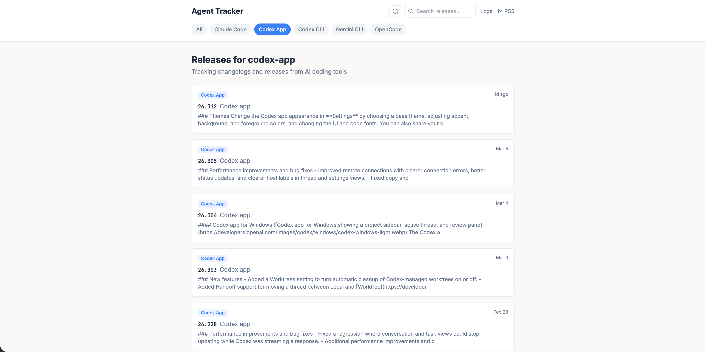

# Agent Tracker

[English](README.md) | [简体中文](README.zh-CN.md)

Agent Tracker 是一个用来追踪 AI 编码工具更新动态的小型 Web 应用。

它会从 GitHub Release 和官方 Changelog 拉取数据，统一存进本地 SQLite，然后提供一个简单界面来查看最新更新、按工具筛选、搜索历史内容、查看同步日志，以及订阅 RSS。



## 当前跟踪的工具

- Claude Code
- Codex App
- Codex CLI
- Gemini CLI
- OpenCode

## 项目结构

- `server`：基于 Go + Gin + SQLite 的后端，负责同步、存储和 API
- `web`：基于 React + Vite + Tailwind 的前端

## 本地启动

### 1. 启动后端

```bash
cd server
mkdir -p data/logs
go run .
```

后端默认读取 `server/config.toml`，监听端口 `10001`。

### 2. 启动前端

另开一个终端：

```bash
cd web
bun install
bun run dev
```

前端默认运行在 `http://localhost:20001`，并会把 `/api` 和 `/rss` 请求代理到 `http://localhost:10001`。

### 3. 打开页面

浏览器访问：

```text
http://localhost:20001
```

## 配置说明

后端默认配置文件是 `server/config.toml`：

```toml
data_dir = "./data"
log_path = "./data/logs/sync.log"
port = "10001"
```

如果要修改数据目录、日志路径或端口，直接改这个文件。
